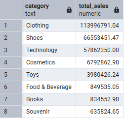

# Consultas en SQL

## **1. Total de ventas por categoría de producto**
### **Consulta:**
```sql
CREATE INDEX idx_invoices_category ON Invoices(category_id);

SELECT c.category, SUM(i.quantity * i.price) AS total_sales
FROM Invoices i
JOIN Categories c ON i.category_id = c.category_id
GROUP BY c.category
ORDER BY total_sales DESC;
```
### **Explicación:**
- Se crea un índice en `category_id` para optimizar la consulta.
- Se calcula el total de ventas por categoría multiplicando la cantidad por el precio.
- Se agrupan los resultados por categoría y se ordenan en orden descendente según las ventas.

### **Resultado:** 


---

## **2. Clientes con mayor volumen de compras**
### **Consulta:**
```sql
CREATE INDEX idx_invoices_customer ON Invoices(customer_id);

SELECT c.customer_id, SUM(i.quantity * i.price) AS total_spent
FROM Invoices i
JOIN Customers c ON i.customer_id = c.customer_id
GROUP BY c.customer_id
ORDER BY total_spent DESC
LIMIT 5;
```
### **Explicación:**
- Se crea un índice en `customer_id` para mejorar la eficiencia.
- Se obtiene el total pagado por cada cliente sumando la cantidad por el precio.
- Se agrupan los datos por cliente y se ordenan en orden descendente.
- Se usa `LIMIT 5` para mostrar solo los cinco clientes con mayor volumen de compra.

### **Resultado:** 


---

## **3. Métodos de pago más utilizados**
### **Consulta:**
```sql
CREATE INDEX idx_invoices_payment_method ON Invoices(payment_method_id);

SELECT pm.payment_method, COUNT(i.invoice_no) AS usage_count
FROM Invoices i
JOIN payment_methods pm ON i.payment_method_id = pm.payment_method_id
GROUP BY pm.payment_method
ORDER BY usage_count DESC;
```
### **Explicación:**
- Se crea un índice en `payment_method_id`.
- Se determina cuántas veces se ha utilizado cada método de pago.
- Se agrupa por método de pago y se ordena en orden descendente.

### **Resultado:** 


---

## **4. Comparación de ventas por mes**
### **Consulta:**
```sql
CREATE INDEX idx_invoices_date ON Invoices(invoice_date);

SELECT
    EXTRACT(MONTH FROM invoice_date) AS mes,
    SUM(CASE WHEN EXTRACT(YEAR FROM invoice_date) = 2021 THEN quantity * price END) AS "2021",
    SUM(CASE WHEN EXTRACT(YEAR FROM invoice_date) = 2022 THEN quantity * price END) AS "2022",
    SUM(CASE WHEN EXTRACT(YEAR FROM invoice_date) = 2023 THEN quantity * price END) AS "2023",
    SUM(quantity * price) AS total_mes
FROM Invoices
GROUP BY mes
ORDER BY mes;
```
### **Explicación:**
- Se crea un índice en `invoice_date`.
- Se extrae el mes de la fecha de la factura.
- Se suman las ventas por mes separadas por año usando `CASE WHEN`.
- Se agrega una columna adicional `total_mes` que muestra la suma total de ventas en el mes sin importar el año.
- Se agrupan los resultados por mes y se ordenan de forma ascendente.

### **Resultado:** 


